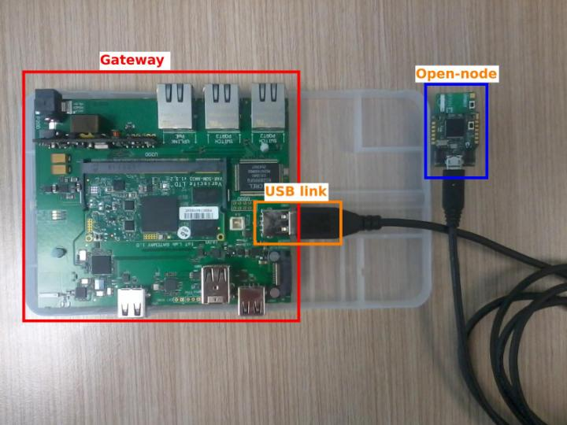

Introduction
============

The Iot-LAB experimental platform allow users to conduct remote
experiments on wireless sensor board (such as an Arduino board with an
Xbee module). For this purpose,a board called *open-node*, can be
connected to the IoT-LAB gateway, via the usb port. Bellow, the picture
of an open-node connected to a gateway.

On the linux distribution installed on the gateway, runs a Python module providing a REST API for open-node management. The gateway can perform open-node commands like flashing a firmware or switch on his power supply. This document shows how to integrate a new open-node in the Iot-Lab platform. This integration is based on a plugin system provided by the Python module.

Requirement
===========

Your node must be powered by USB. You must have developed at least two firmwares for your node: an autotest firmware and an idle firmware (described bellow).

Adding a new open-node
======================

You can get the Python module code by cloning the git repository:

    $ git clone git@github.com:iot-lab/iot-lab-gateway.git

Module architecture
-------------------

This section present the module architecture.

        |
        |
        +-gateway_code/
        |   |
        |   +-rest-server.py ........... The API entry point
        |   +-common.py
        |   +-gateway_manager.py
        |   +-autotest/............................... Directory for all the autotests
        |   +-utils/.. Contains script for serial operation such as serial redirection or programmer
        |   |   |
        |   |   +-----avrdude.py
        |   |   +-----openocd.py
        |   |
        |   +-static/..... Contains the firmwares and the configuration file
        |   |   |
        |   |   +-----m3_idle.elf
        |   |   +-----m3_autotest.elf
        |   |   +-----iot-lab-m3.cnf
        |   |
        |   +-open_nodes/... Contains the code to interact with the open-node, you will put your code here
        |       |
        |       +-----node_a8.py
        |       +-----node_m3.py
        |       +-----node_fox.py
        |       +-----node_leonardo.py
        |       +-----node_mega.py
        |
        |
        +-bin/
            |
            +-rules.d .................. Directory for the udev rules
                +-----m3.rules
                +-----a8.rules

Between two plugs, the name of the device as detected by the embedded linux running on the gateway can change: for example, an unique device can be succesively detected as ttyUSB0 and then as ttyUSB1. As it is essential to have a fixed name for your device, you have to write a udev rules specific for your device. To do such a thing, you must create a file named `your_node.rules` (with `your_node` the name of your node). Using the command `udevadm`, you have to retrieve some information to identify your node such as the serial id, the vendor id or the product id. You must set a name for the device and set the right group (dialout) and the right mode (664). The convention is to name device `ttyON_NODENAME`. Bellow the example of the udev rule for the M3 node:

    SUBSYSTEM=="tty", SUBSYSTEMS=="usb", ENV{ID_SERIAL}=="IoT-LAB_M3",
    ENV{ID_USB_INTERFACE_NUM}=="01",  SYMLINK+="ttyON_M3"

    SUBSYSTEM=="usb", ATTR{idProduct}=="6011", ATTR{idVendor}=="0403",
    MODE="0664", GROUP="dialout"

Plugin integration
------------------

### Naming convention

As said previously, the application is based on a system of plugin: if
you want to add a node, you just have to write a specific file to
interface with the application. When the application is launched, it reads the name of your open node located in the file

    /var/local/config/board_type

and then will use the class named Node{nameofyournode} located in

    gateway-code/open_node/node_{nameofyournode}.py

to manage the expreriment.

For example, if `smt32nucleo` is registered on the gateway, the class used by the gateway will be `NodeStm32nucleo`, declared in the file `gateway-code/open_node/node_stm32nucleo.py`.

If the name of your class or if your file is not right formatted, an
explicit error will be raised at the launching of the application.

### Interfacing the python code

During the experiment and the tests, the application use several
attributes located in your class. Those attributes are the characteristics
of your node and we can find for example, the name of your device as
chosen in the udev rules (e.g. TTY); the baudrate which allows the
communication between the gateway and your node (e.g. BAUDRATE). The list
of the mandatory attributes are present in the template file in the
annex. These attribute are required by the gateway for a good
working. You can add your own attribute if needed by your class.

The API provides services. These services are loaded dynamically,
regarding what your open-node allows to do. These services are based on
method implemented in your file: if the API need a specific method to
create a service, the gateway-code will check if your class implement
this method. If it doesn’t, the service will not be available.

Some services are always available, such as the start and stop of an experiment.
The methods required by these services are mandatory and are the following:

+ `setup`: Perform all the actions required to properly start an experiment.
+ `teardown`: Perform all the actions required to properly stop an experiment.
+ `flash`: Flash a firmware on the open-node.

Other services will be available if the corresponding methods are implemented.
These methods are the following:

+ `reset`: Reset the open-node.
+ `debug_start`: Start the open-node debugger.
+ `debug_stop`: Stop the open-node debugger.

The template file, given in annex, gathers all the functions which interfaces
with the code of the gateway. Here is a simple illustration of the
execution of the `start_exp` command.

Do not hesitate to watch the other implementations of open nodes to have
a better idea of what the application expects.

### Errors and return values

When one of the function described above terminates with a success, the
return value must be 0. When the return value is different from 0, the
application know that something gone wrong. Except status, all the method
in the template file return an error.

### Flashing the open node

Some methods such as `reset`, `flash` or `debug_start`, need to interact
with the serial port of the open node. To do this, you will have to use
a programmer software and write code to interact with it. `Openocd` and
`Avrdude` are already available but maybe you will need to use another
programmer and implement your own python file in the `gateway_code/utils/`
folder.

Writing firmwares
-----------------

To add your code in the IoT-Lab platform, you must have writen two
firmwares. These firmwares must be put in the `gateway_code/static/` folder
as shown by the directory architecture.

### Idle firmware

The idle firmware, must be a program with a consumption as low as
possible (no led blinking, and no infinite loop). This firmware is
flashed on the open node when no experiment is running.

### Autotest firmware

The autotest firmware is used during the testing phase. IotLAB-platform
allows you to perform autotests for your device. It could be useful to
see if the sensor on your node are still alive and send valid
data. During the testing phase, the gateway will flash the autotest
firmware on the open-node and will then send some commands to the
open-node. For example, if your node embeds a light sensor, the gateway
will send the following command on the serial port: `get_light`. Your
autotest firmware will receive this order, ask to the light sensor a
measure and then send back to the gateway: `ACK get_light <value_of_measure> lux`. Thanks to this, the gateway will
know that the light sensor on your open-node works. An annex
file gather all the autotest command which can be send by the gateway.
Among all these tests, one is mandatory: `echo`.

This test ensures that your open-node is answering on the serial.
`echo` command must behave as described bellow:

    Gateway message : 'echo HELLO WORLD'
    Node answer : 'HELLO WORLD'

    Gateway message : 'echo ACK'
    Node answer : 'ACK'

To inform the application what kind of command your autotest firmware
can handle, you must write the name of the test in the list
`AUTOTEST_AVAILABLE` as shown in the template file.

Testing your implementation
---------------------------

### Unit tests

When developing your implementation, you should verify that all unit tests pass on your computer by running `tox`.

> You need an up to date `tox` version. I recommend installing it with pip
>
>     sudo -H pip install --upgrade tox

### Integration tests

To run the integration/system tests directly on the board, including the autotest use the following command:

    fab -f tests_utils/integration_fabfile.py python_test -H adress-of-your-node

> It requires also quite up to date fabric version, I'm running `fabric 1.10.2` with `paramiko 1.15.2`
>
>     sudo -H pip install --upgrade fabric

Annexe
======

template file
-------------

Bellow you can find a template file which interface with the gateway
application with proper comment, free to you to use it and modify it:

    # -*- coding:utf-8 -*-
    """ Blank file for the implemention of an open-node called Nodename """

    from gateway_code.config import static_path
    from gateway_code import common
    from gateway_code.common import logger_call

    import logging
    LOGGER = logging.getLogger('gateway_code')

    class NodeNodename(object):

        TTY = '/dev/ttyON_NODENAME'
        # The tty as named in the udev rule
        BAUDRATE = 9600
        # The baudrate used to communicate with the open-node on the serial port
        FW_IDLE = static_path('nodename_idle.elf')
        # The name of the idle firmware
        FW_AUTOTEST = static_path('nodename_autotest.elf')
        # The name of the autotest firmware
        ALIM = '5V'
        # The tension of alimentation (will be 5V in most of the case)

        AUTOTEST_AVAILABLE = ['echo']

        # The list of autotest available for your node.
        # As describe in the document,
        # this list must contain at least 'echo'

        def __init__(self):
            # The initialization of your class

        @logger_call("Node Nodename : Setup of Nodename")
        def setup(self, firmware_path):
            # Here you will perform all the necessary action needed
            # by your node before the start of an experiment.
            return 1

        @logger_call("Node Nodename : teardown of nodename node")
        def teardown(self):
            # Here you will perform all the necessary action to
            # properly terminate your node
            return 1

        @logger_call("Node Nodename : flash of nodename node")
        def flash(self, firmware_path=None):
            # Here
            return 1

        @logger_call("Node Nodename : reset of nodename node")
        def reset(self):
            # Not implemented
            return 1

        def debug_start(self):
            # Here you will start the debug of your node
            return 1

        def debug_stop(self):
            # Here you will stop the debug of your node
            return 1

        @staticmethod
        def status():
            # Here you will check your node (for exemple with ftdi chip)
            # if you are unable to check your node, just return 0
            return 0

Autotests available
-------------------

Bellow you will find commands that can be sent by the gateway during the
tests and the corresponding format of the return expected.

| Command                             | Answer format                          |
| ----------------------------------- | -------------------------------------- |
| `echo arg1 arg2 ...`                | `arg1 arg2 ...`                        |
| `get_time`                          | `ACK get_time 122953 T_UNIT`           |
| `get_uid`                           | `ACK get_uid 05D8FF323632483343037109` |
| `get_gyro`                          | `ACK get_gyro X. Y. Z. dps`            |
| `get_magneto`                       | `ACK get_magneto X. Y. Z. gauss`       |
| `get_accelero`                      | `ACK get_accelero X. Y. Z. g`          |
| `get_pressure`                      | `ACK get_pressure P. mbar`             |
| `get_light`                         | `ACK get_light L. lux`                 |
| `test_gpio`                         | `ACK test_gpio`                        |
| `test_i2c`                          | `ACK test_i2c`                         |
| `radio_pkt [channel] [power]`       | `ACK radio_pkt CHANNEL POWER`          |
| `radio_ping_pong [channel] [power]` | `ACK radio_ping_pong CHANNEL POWER`    |
| `leds_on [flag]`                    | `ACK leds_on [flag]`                   |
| `leds_off [flag]`                   | `ACK leds_off [flag]`                  |
| `leds_blink [flag] [time]`          | `ACK leds_blink [flag] [time]`         |
| `test_pps_start`                    | `ACK test_pps_start`                   |
| `test_pps_get`                      | `ACK test_pps_get`                     |
| `test_pps_stop`                     | `ACK test_pps_stop`                    |